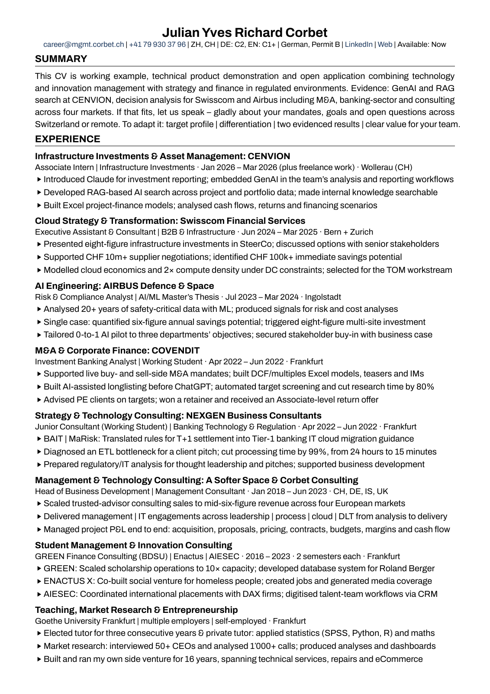
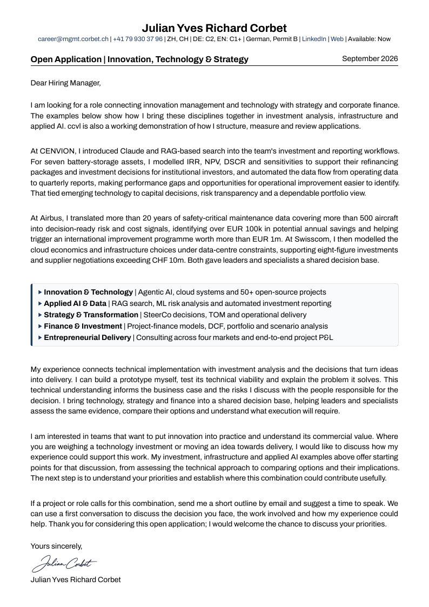
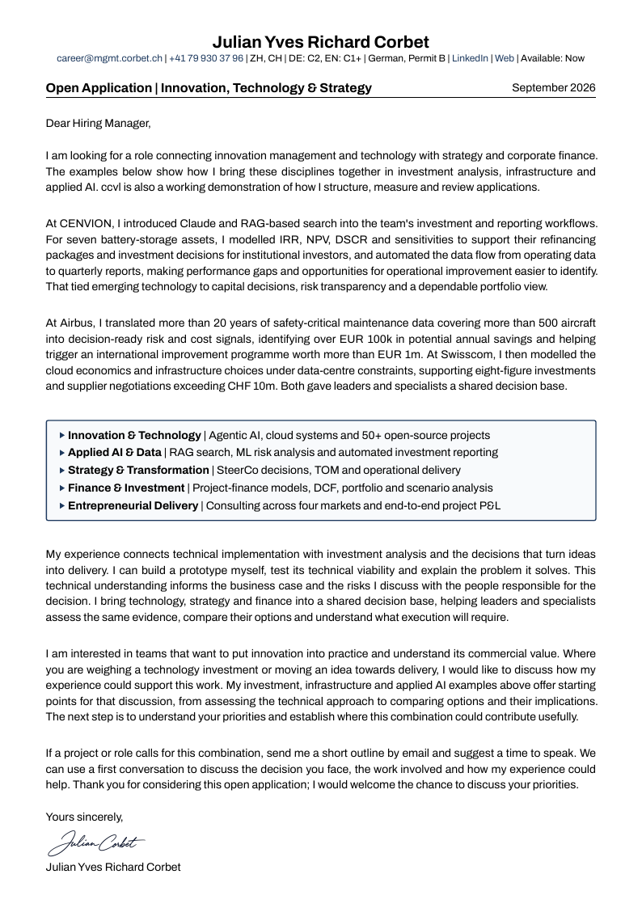
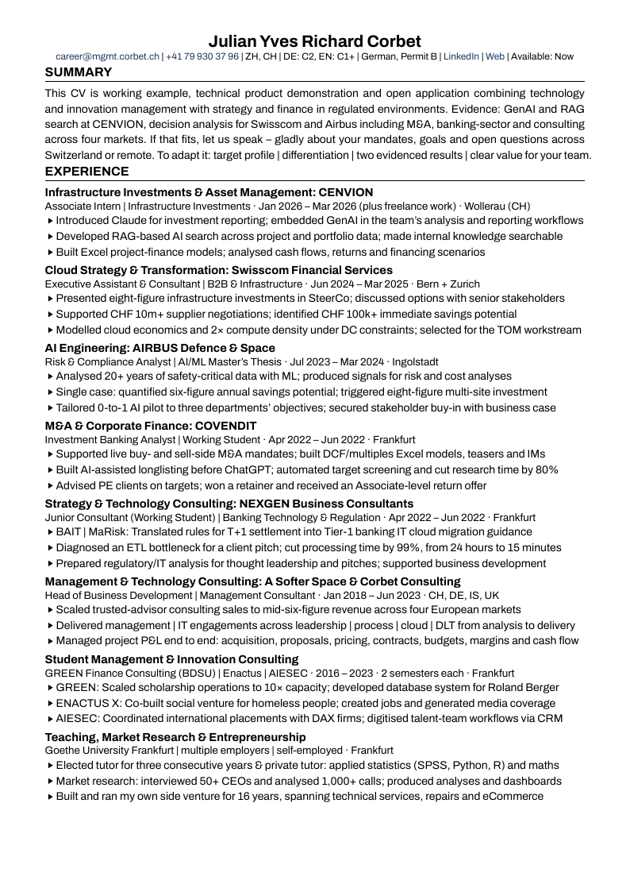
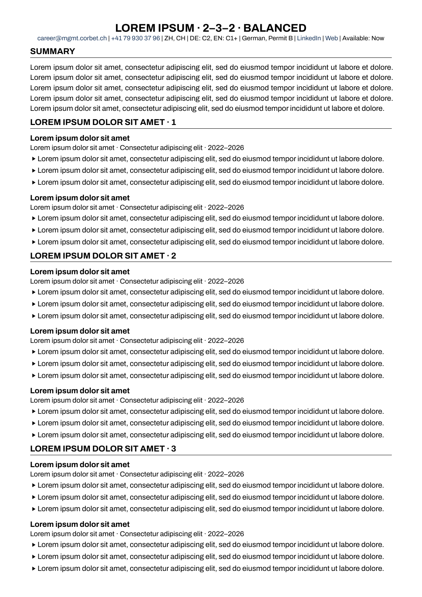

# Document styles and rendered gallery

`cvl/` owns the approved general documents and their showcase outputs. Private
source evidence stays in `interview/`; concrete applications stay in
`opportunities/`. Harvard contains the approved showcase; Cluster retains
explicitly unfinished Lorem Ipsum for its layout milestone. The displayed
name/contact come from the approved public profile.

## Full structure

The hierarchy is **document → style → substyle → language → country**.

```text
cvl/
├── profile.toml                         # approved render identity
├── assets/                              # approved shared profile assets
├── shared/                              # each family's chosen sharing
│   ├── harvard/{defaults.toml,style.typ,application.typ,style.toml}
│   ├── cluster/defaults.toml
│   └── modern/defaults.toml
├── cv/
│   ├── harvard/
│   │   ├── style.toml, contract.toml, scaffold.toml
│   │   ├── content/{de,en}/ch/wording.toml
│   │   ├── src/                         # Harvard's internal arrangement
│   │   ├── d-plus/{de,en}/ch/<leaf>     # default
│   │   ├── standard/{de,en}/ch/<leaf>
│   │   ├── compact/{de,en}/ch/<leaf>
│   │   └── aligned/{de,en}/ch/<leaf>
│   ├── cluster/
│   │   ├── style.toml, contract.toml, scaffold.toml, layout.typ
│   │   ├── content/{de,en}/ch/wording.toml
│   │   └── {d-plus,standard,middle-three,middle-three-spaced}/{de,en}/ch/<leaf>
│   ├── modern/
│   │   ├── style.toml, contract.toml, scaffold.toml, layout.typ
│   │   ├── content/{de,en}/ch/wording.toml
│   │   └── {standard,timeline}/{de,en}/ch/<leaf>
│   └── slot-4/style.toml                # empty style slot
└── cl/
    ├── harvard/
    │   ├── style.toml, contract.toml, scaffold.toml, src/
    │   ├── content/{de,en}/ch/wording.toml
    │   ├── left-rule/{de,en}/ch/<leaf>  # default
    │   └── frame/{de,en}/ch/<leaf>
    └── {slot-2,slot-3,slot-4}/style.toml # empty style slots

Each substyle directory also has substyle.toml. Empty substyle slots appear
only in their style.toml and have no directory.
Each <leaf> contains:
├── content.toml                         # wording reference, metadata, exceptions
├── strings.toml                         # translated labels and chrome
├── layout.toml                          # locale-specific layout and text settings
├── typst/{cv|cl}.typ                     # engine entry point with input defaults
├── pdf/{cv-N|cl}.pdf                     # checked-in outputs
└── preview/*.png                        # actual rendered pages
```

There is no universal `src/`, column layout, font, shape or paragraph model.
Each style owns these choices. A substyle varies a design within its parent;
`frame` and `left-rule` belong to Harvard. The optional `.agent/typst/document.typ` adapter only applies
explicit settings; a style can use its own Typst setup instead.

## Where to edit wording

| Change | File |
| --- | --- |
| Text shared by a style's substyles | `<style>/content/<language>/<country>/wording.toml` |
| A wording exception for one substyle | Its leaf's `content.toml` |
| A tailored private application | Its opportunity's `application.toml` |

Every leaf names its shared source under `[wording].source`. Sharing stays
inside the same document/style/language/country. Harvard, Cluster and Modern each own
independent wording; CV and letter sources are separate.
Nested fields merge, while arrays replace whole arrays. Private opportunity
records remain self-contained. See [the interface](../.agent/docs/styles.md)
for the exact source and override rules.

## What ships

| Style | CV substyles | CL substyles | Font | Locale / paper | CV pages | CL pages |
| --- | --- | --- | --- | --- | --- | --- |
| Harvard | d-plus, standard, compact, aligned | left-rule, frame | Archivo | de-ch / en-ch, portrait A4 | 2, 3, 4 | 1 |
| Cluster | d-plus, standard, middle-three, middle-three-spaced | — | Archivo | de-ch / en-ch, portrait A4 | 1 | — |
| Modern | standard, timeline | — | Archivo | de-ch / en-ch, portrait A4 | 1 | — |

Substyles are listed in order; the first is each style's default.
This produces **40 registered PDFs / 88 pages**, plus two five-page D+
comparisons. The [cluster example](cv/cluster/README.md) is a typesetting
milestone with unfinished Lorem Ipsum content. [Modern](cv/modern/README.md)
is a scaffold whose design is not yet defined. The defaults are Harvard D+ for
CV and Harvard left-rule for CL. All styles declare their page presets;
Harvard's station and five-line-summary contracts apply only to Harvard.

Each document offers four styles with five substyles each. Like save slots
in a game, positions without a design yet are kept as named slots
(`slot-<n>`): they hold the grid's order and render nothing until a new
design fills them. `bash ./ccvl list-styles` shows the grid with its designed
styles, its slots and the defaults.

## Compare the designs

These thumbnails are actual first pages of the English Swiss PDFs. Open a PDF
for full-resolution pages. All shipped styles use portrait A4.

| Family / substyle | CV | Cover letter |
| --- | --- | --- |
| harvard / d-plus + left-rule (defaults) | [](cv/harvard/d-plus/en/ch/pdf/cv-4.pdf) | [](cl/harvard/left-rule/en/ch/pdf/cl.pdf) |
| harvard / standard + frame | [](cv/harvard/standard/en/ch/pdf/cv-4.pdf) | [](cl/harvard/frame/en/ch/pdf/cl.pdf) |
| harvard / compact | [](cv/harvard/compact/en/ch/pdf/cv-4.pdf) | — |
| cluster / d-plus (unfinished example) | [](cv/cluster/d-plus/en/ch/pdf/comparison-5.pdf) | — |

## Selection and defaults

The engine discovers `style.toml`, selects substyle/locale/pages, supplies
application/profile/configuration inputs, compiles the entry point, and verifies
the selected contract. That interface is the common denominator.

Records use `options.cv_style`, `options.cl_style`, `options.cv_substyle`,
`options.cl_substyle`, `options.language`, `options.pages` and optional
`options.cl_pages`, `options.cv_paper` and `options.cl_paper`. A missing
selection, or the reserved name `default`, uses the manifest's default style
and that style's first substyle. The shipped renderers merge
**family defaults → substyle → locale layout → selected paper preset**.
Language and paper are separate decisions; the engine imposes no
country-to-paper mapping.

Harvard, Cluster and Modern currently support A4. `--paper` selects a supported paper
without changing folders;
nondefault papers add their name to the PDF filename, preserving the default
showcase. Unsupported choices fail instead of shrinking text or adding pages.

```sh
bash ./ccvl build-cv en-ch 4 --style harvard --substyle d-plus
bash ./ccvl build-cv en-ch 1 --style cluster --substyle d-plus
bash ./ccvl build-cl en-ch --style harvard --substyle frame
bash ./ccvl build-cv de-ch 4 --style harvard --substyle standard --paper a4
bash ./ccvl list-documents
bash ./ccvl list-styles
```

Use [the style-creation skill](../.agent/skills/ccvl-style/SKILL.md),
[the interface](../.agent/docs/styles.md), and
[the Typst defaults audit](../.agent/docs/typst-defaults.md) for new designs.
Reusable changes originate in ccvl and merge into applications; private
research, evidence and tailored wording remain downstream.

## Reproduce the gallery

On a development/CI host with the published ccvl runtime, Poppler and jq:

```sh
bash ./ccvl build
bash .agent/scripts/render-previews.sh
bash ./ccvl public-check
```

The script enumerates registered outputs and renders changed PDFs at 96 dpi
into their adjacent `preview/` directory. Unchanged PDFs reuse previews when
the rasterizer and rendering settings match and every image is intact; local
cache records live in `.agent/cache/previews/`. It consumes the actual PDFs; it does not
invent mockups. Inspect every changed page at full resolution as well as in
this comparison. A shorter PDF's surplus page previews are removed after a
successful refresh. Remove obsolete previews if entire page presets are removed.
