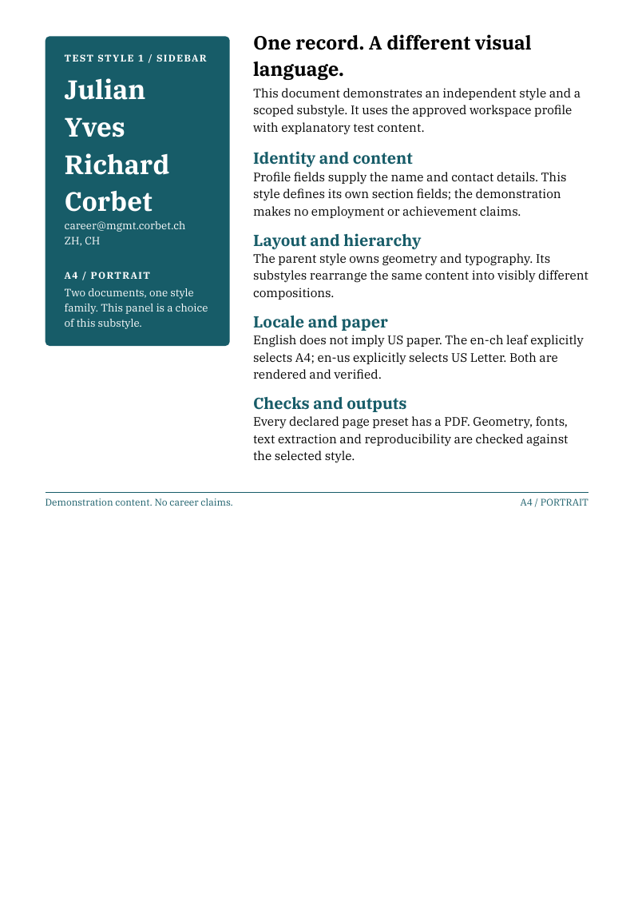
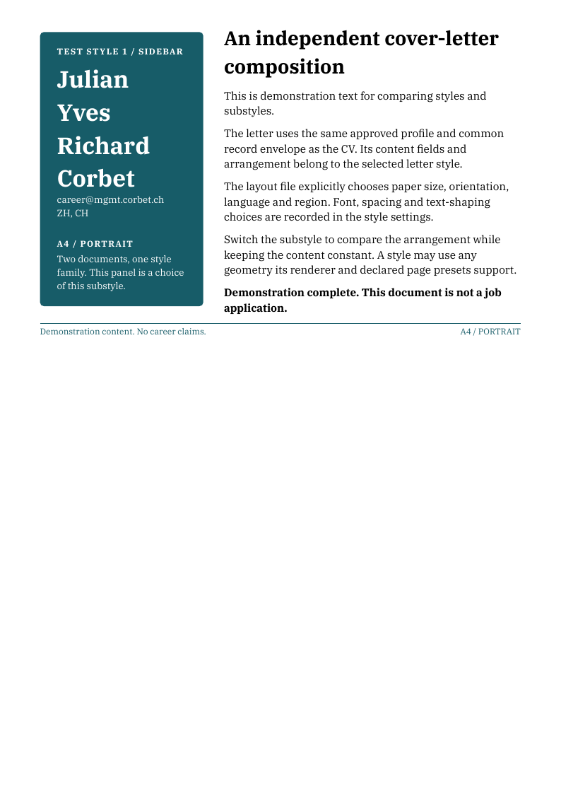
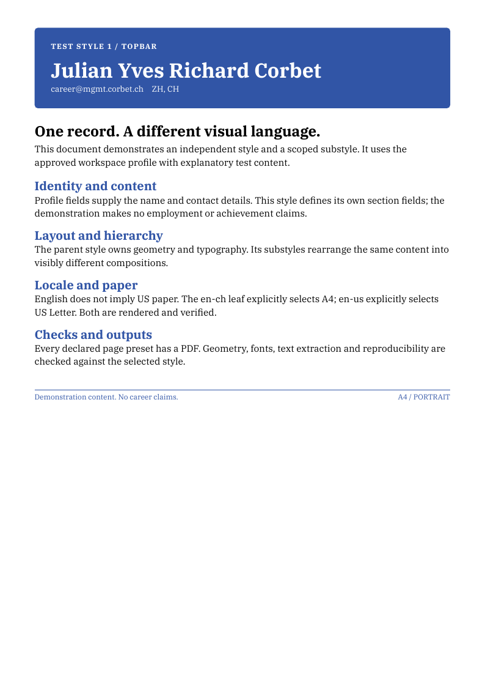
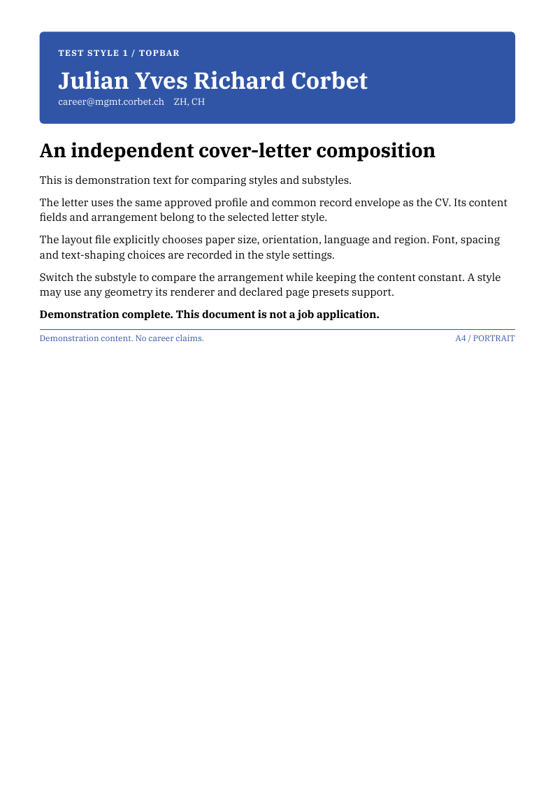
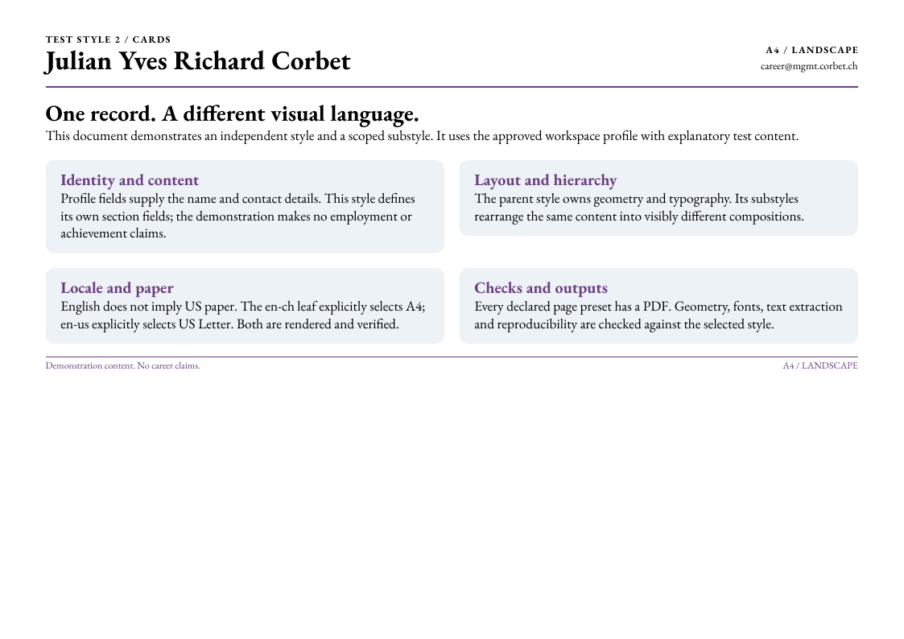
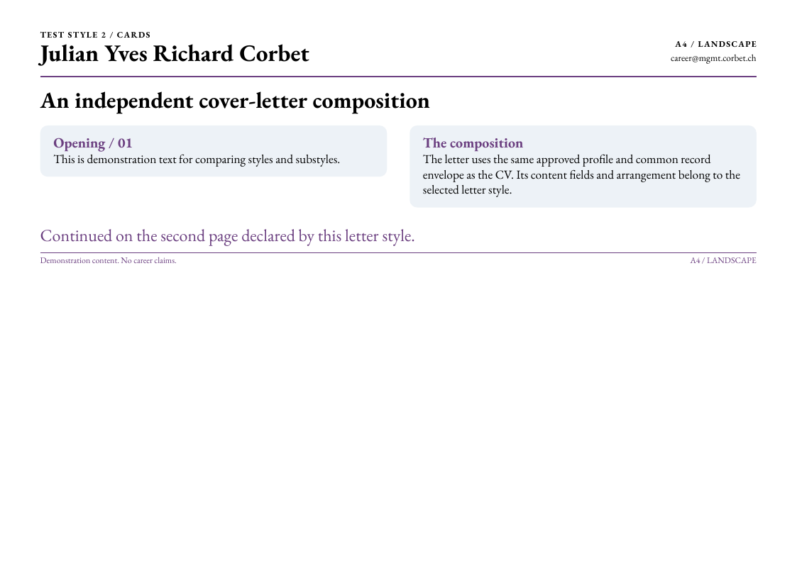
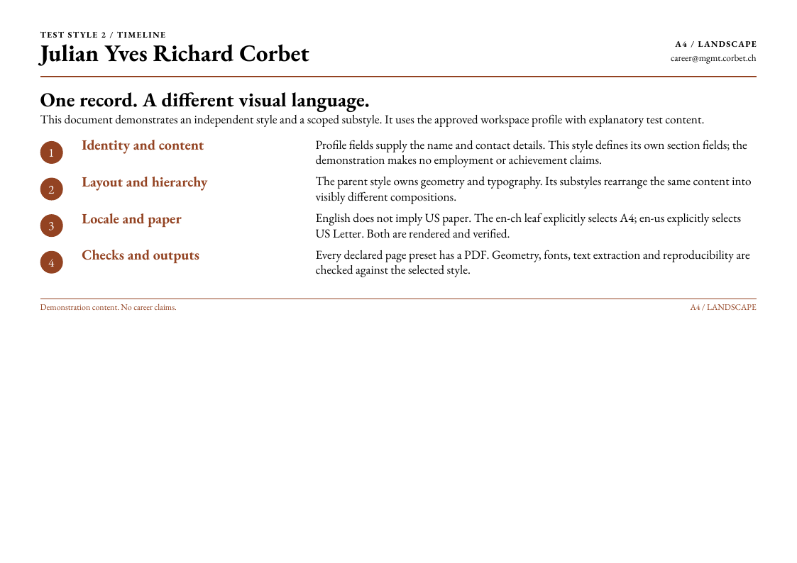
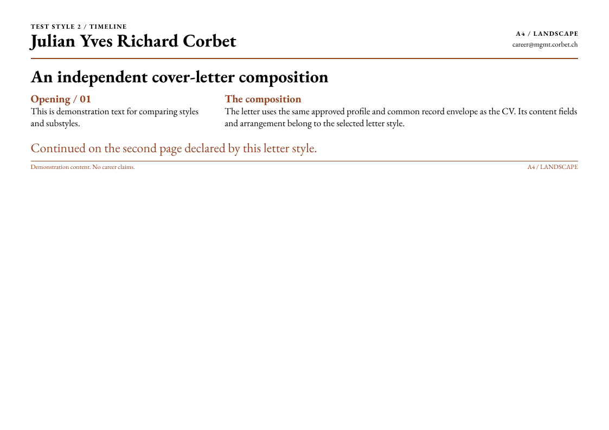

# Document styles and rendered gallery

`cvl/` owns the approved general documents and their showcase outputs. Private
source evidence stays in `interview/`; concrete applications stay in
`opportunities/`. The demonstration text below explains layouts and makes no
career claims. The displayed name/contact come from the approved public profile.

## Full structure

The hierarchy is **document → style → substyle → language → country**.

```text
cvl/
├── profile.toml                         # approved render identity
├── assets/                              # approved shared profile assets
├── shared/                              # each family's chosen sharing
│   ├── harvard/{defaults.toml,style.typ,application.typ,style.toml}
│   ├── test-style-1/defaults.toml
│   └── test-style-2/defaults.toml
├── cv/
│   ├── harvard/
│   │   ├── style.toml, contract.toml, scaffold.toml
│   │   ├── content/{de,en}/ch/wording.toml
│   │   ├── src/                         # Harvard's internal arrangement
│   │   ├── standard/{de,en}/ch/<leaf>
│   │   └── compact/{de,en}/ch/<leaf>
│   ├── test-style-1/
│   │   ├── style.toml, contract.toml, scaffold.toml
│   │   ├── content/en/{ch,us}/wording.toml
│   │   ├── layout.typ                   # this style puts its renderer here
│   │   ├── sidebar/en/{ch,us}/<leaf>
│   │   └── topbar/en/{ch,us}/<leaf>
│   └── test-style-2/
│       ├── style.toml, contract.toml, scaffold.toml
│       ├── content/en/{ch,us}/wording.toml
│       ├── parts/composition.typ        # a different internal arrangement
│       ├── cards/en/{ch,us}/<leaf>
│       └── timeline/en/{ch,us}/<leaf>
└── cl/
    ├── harvard/{style.toml,contract.toml,scaffold.toml,src/}
    │   ├── content/{de,en}/ch/wording.toml
    │   ├── left-rule/{de,en}/ch/<leaf>
    │   └── frame/{de,en}/ch/<leaf>
    ├── test-style-1/{style.toml,contract.toml,scaffold.toml,layout.typ}
    │   ├── content/en/{ch,us}/wording.toml
    │   ├── sidebar/en/{ch,us}/<leaf>
    │   └── topbar/en/{ch,us}/<leaf>
    └── test-style-2/{style.toml,contract.toml,scaffold.toml,parts/composition.typ}
        ├── content/en/{ch,us}/wording.toml
        ├── cards/en/{ch,us}/<leaf>
        └── timeline/en/{ch,us}/<leaf>

Each substyle directory also has substyle.toml.
Each <leaf> contains:
├── content.toml                         # wording reference, metadata, exceptions
├── strings.toml                         # translated labels and chrome
├── layout.toml                          # locale-specific layout and text settings
├── typst/{cv|cl}.typ                     # engine entry point with input defaults
├── pdf/{cv-N|cl}.pdf                     # checked-in outputs
└── preview/*.png                        # actual rendered pages
```

There is no universal `src/`, column layout, font, shape or paragraph model.
Each style owns these choices. A substyle varies a design within its parent;
`frame` and `left-rule` belong to Harvard. The two test families import no
Harvard code. The optional `.agent/typst/document.typ` adapter only applies
explicit settings; a style can use its own Typst setup instead.

## Where to edit wording

| Change | File |
| --- | --- |
| Text shared by a style's substyles | `<style>/content/<language>/<country>/wording.toml` |
| A wording exception for one substyle | Its leaf's `content.toml` |
| A tailored private application | Its opportunity's `application.toml` |

Every leaf names its shared source under `[wording].source`. Sharing stays
inside the same document/style/language/country. Harvard, test-style-1 and
test-style-2 each own independent wording; CV and letter sources are separate.
Nested fields merge, while arrays replace whole arrays. Private opportunity
records remain self-contained. See [the interface](../.agent/docs/styles.md)
for the exact source and override rules.

## What ships

| Style | CV substyles | CL substyles | Font | Locale / paper | CV pages | CL pages |
| --- | --- | --- | --- | --- | --- | --- |
| Harvard | standard, compact | left-rule, frame | Archivo | de-ch / en-ch, portrait A4 | 2, 3, 4 | 1 |
| Test style 1 | sidebar, topbar | sidebar, topbar | IBM Plex Serif | en-ch A4 / en-us Letter, portrait | 1 | 1 |
| Test style 2 | cards, timeline | cards, timeline | EB Garamond | en-ch A4 / en-us Letter, landscape | 1, 2 (default) | 2 |

This produces **36 PDFs / 68 pages**. The default remains Harvard standard for
CV and Harvard left-rule for CL. All styles declare their page presets;
Harvard's station and five-line-summary contracts apply only to Harvard.

## Compare the designs

These thumbnails are actual first pages of the English Swiss PDFs. Open a PDF
for full-resolution pages. A4 and Letter links below exercise both geometries.

| Family / substyle | CV | Cover letter |
| --- | --- | --- |
| harvard / standard + left-rule | [](cv/harvard/standard/en/ch/pdf/cv-4.pdf) | [](cl/harvard/left-rule/en/ch/pdf/cl.pdf) |
| harvard / compact + frame | [](cv/harvard/compact/en/ch/pdf/cv-4.pdf) | [](cl/harvard/frame/en/ch/pdf/cl.pdf) |
| test-style-1 / sidebar | [](cv/test-style-1/sidebar/en/ch/pdf/cv-1.pdf) | [](cl/test-style-1/sidebar/en/ch/pdf/cl.pdf) |
| test-style-1 / topbar | [](cv/test-style-1/topbar/en/ch/pdf/cv-1.pdf) | [](cl/test-style-1/topbar/en/ch/pdf/cl.pdf) |
| test-style-2 / cards | [](cv/test-style-2/cards/en/ch/pdf/cv-2.pdf) | [](cl/test-style-2/cards/en/ch/pdf/cl.pdf) |
| test-style-2 / timeline | [](cv/test-style-2/timeline/en/ch/pdf/cv-2.pdf) | [](cl/test-style-2/timeline/en/ch/pdf/cl.pdf) |

## All demonstration PDFs

| Style / substyle | A4 CV | US Letter CV | A4 letter | US Letter letter |
| --- | --- | --- | --- | --- |
| test-style-1 / sidebar | [1 page](cv/test-style-1/sidebar/en/ch/pdf/cv-1.pdf) | [1 page](cv/test-style-1/sidebar/en/us/pdf/cv-1.pdf) | [1 page](cl/test-style-1/sidebar/en/ch/pdf/cl.pdf) | [1 page](cl/test-style-1/sidebar/en/us/pdf/cl.pdf) |
| test-style-1 / topbar | [1 page](cv/test-style-1/topbar/en/ch/pdf/cv-1.pdf) | [1 page](cv/test-style-1/topbar/en/us/pdf/cv-1.pdf) | [1 page](cl/test-style-1/topbar/en/ch/pdf/cl.pdf) | [1 page](cl/test-style-1/topbar/en/us/pdf/cl.pdf) |
| test-style-2 / cards | [1 page](cv/test-style-2/cards/en/ch/pdf/cv-1.pdf) · [2 pages](cv/test-style-2/cards/en/ch/pdf/cv-2.pdf) | [1 page](cv/test-style-2/cards/en/us/pdf/cv-1.pdf) · [2 pages](cv/test-style-2/cards/en/us/pdf/cv-2.pdf) | [2 pages](cl/test-style-2/cards/en/ch/pdf/cl.pdf) | [2 pages](cl/test-style-2/cards/en/us/pdf/cl.pdf) |
| test-style-2 / timeline | [1 page](cv/test-style-2/timeline/en/ch/pdf/cv-1.pdf) · [2 pages](cv/test-style-2/timeline/en/ch/pdf/cv-2.pdf) | [1 page](cv/test-style-2/timeline/en/us/pdf/cv-1.pdf) · [2 pages](cv/test-style-2/timeline/en/us/pdf/cv-2.pdf) | [2 pages](cl/test-style-2/timeline/en/ch/pdf/cl.pdf) | [2 pages](cl/test-style-2/timeline/en/us/pdf/cl.pdf) |

Style 1 moves the identity panel from a sidebar to a full-width top bar. Style 2
changes the reading structure between a two-column card grid and numbered
rows. Its second page demonstrates a continuation layout. Both CV and letter
use the same family; their content structures and page counts remain distinct.

## Selection and defaults

The engine discovers `style.toml`, selects substyle/locale/pages, supplies
application/profile/configuration inputs, compiles the entry point, and verifies
the selected contract. That interface is the common denominator.

Records use `options.cv_style`, `options.cl_style`, `options.cv_substyle`,
`options.cl_substyle`, `options.language`, `options.pages` and optional
`options.cl_pages`, `options.cv_paper` and `options.cl_paper`. Missing selections
use explicit manifest/style defaults. The shipped renderers merge
**family defaults → substyle → locale layout → selected paper preset**.
Language and paper are separate decisions: these examples choose A4 for CH and
Letter for US, but the engine imposes no country-to-paper mapping.

Harvard currently supports A4. Both test styles support A4 and US Letter in
either locale. `--paper` selects a supported paper without changing folders;
nondefault papers add their name to the PDF filename, preserving the default
showcase. Unsupported choices fail instead of shrinking text or adding pages.

```sh
bash ./ccvl build-cv en-us --style test-style-1 --substyle sidebar
bash ./ccvl build-cv en-ch 2 --style test-style-2 --substyle cards
bash ./ccvl build-cl en-us --style test-style-2 --substyle timeline
bash ./ccvl build-cv en-us --style test-style-1 --substyle sidebar --paper a4
bash ./ccvl list-documents
```

Use [the style-creation skill](../.agent/skills/ccvl-style/SKILL.md),
[the interface](../.agent/docs/styles.md), and
[the Typst defaults audit](../.agent/docs/typst-defaults.md) for new designs.
Reusable changes originate in ccvl and merge into applications; private
research, evidence and tailored wording remain downstream.

## Reproduce the gallery

On a development/CI host with the published ccvl runtime, Poppler and jq:

```sh
bash ./ccvl build
bash .agent/scripts/render-previews.sh
bash ./ccvl public-check
```

The script enumerates registered outputs and renders changed PDFs at 96 dpi
into their adjacent `preview/` directory. Unchanged PDFs reuse previews when
the rasterizer and rendering settings match and every image is intact; local
cache records live in `.agent/cache/previews/`. It consumes the actual PDFs; it does not
invent mockups. Inspect every changed page at full resolution as well as in
this comparison. A shorter PDF's surplus page previews are removed after a
successful refresh. Remove obsolete previews if entire page presets are removed.
